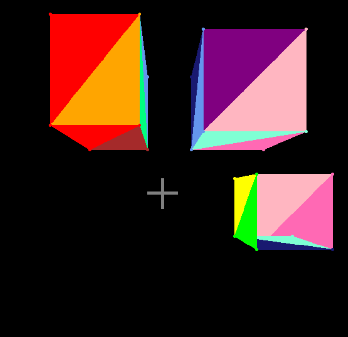

# A demo of drawing 3D triangles onto a 2D screen
The demo uses first person perspective with an FOV of 90 degrees. It was part of my semester 1 project for my Multivariable Calculus class in 12th grade. I also uploaded the presentation and other materials here.

